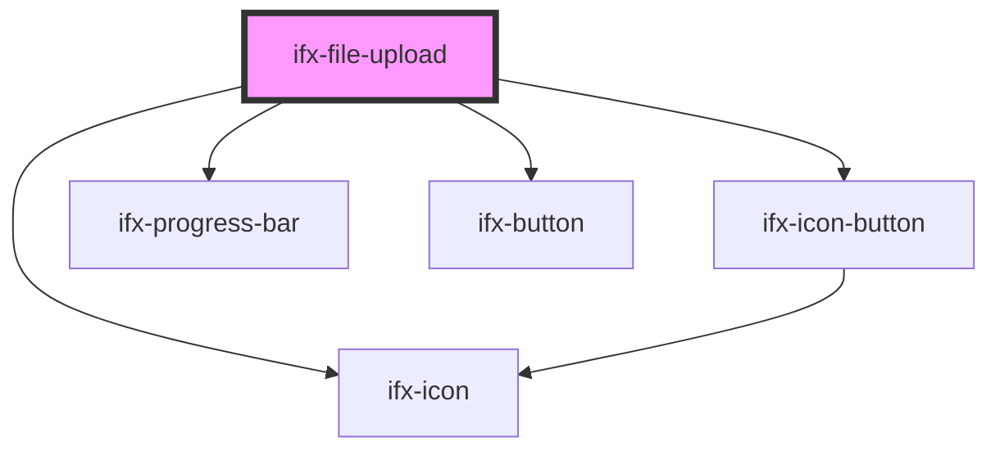

# ifx-file-upload

<!-- Auto Generated Below -->

## Properties

| Property                        | Attribute                          | Description                                                                                                                                                                  | Type                                                                     | Default                                                           |
| ------------------------------- | ---------------------------------- | ---------------------------------------------------------------------------------------------------------------------------------------------------------------------------- | ------------------------------------------------------------------------ | ----------------------------------------------------------------- |
| `additionalAllowedFileTypes`    | `additional-allowed-file-types`    | Extra file types to allow in addition to the  default ones.                                                                                                                  | `string \| string[]`                                                     | `[]`                                                              |
| `allowAnyFileType`              | `allow-any-file-type`              | When set to true, allows any file type to be uploaded (no file type restrictions).                                                                                           | `boolean`                                                                | `false`                                                           |
| `allowedFileExtensions`         | `allowed-file-extensions`          | Custom file extensions to allow (e.g., 'xml', 'asc', 'cfg'). Recommended format: without dots. Also accepts format with dots like '.xml'. Do not use wildcards like '*.xml'. | `string \| string[]`                                                     | `[]`                                                              |
| `allowedFileTypes`              | `allowed-file-types`               | Default set of allowed file extensions (used internally). Can be extended using `additionalAllowedFileTypes`.                                                                | `string \| string[]`                                                     | `undefined`                                                       |
| `ariaLabelBrowseFiles`          | `aria-label-browse-files`          | ARIA label for the “browse files” control.                                                                                                                                   | `string`                                                                 | `"Browse files"`                                                  |
| `ariaLabelCancelUpload`         | `aria-label-cancel-upload`         | ARIA label for the “cancel upload” action.                                                                                                                                   | `string`                                                                 | `"Cancel upload"`                                                 |
| `ariaLabelDropzone`             | `aria-label-dropzone`              | ARIA label for the drop zone area.                                                                                                                                           | `string`                                                                 | `"Upload area. Click to browse or drag and drop files."`          |
| `ariaLabelFileInput`            | `aria-label-file-input`            | ARIA label for the hidden/native file input element.                                                                                                                         | `string`                                                                 | `"Upload file"`                                                   |
| `ariaLabelRemoveFile`           | `aria-label-remove-file`           | ARIA label for the “remove file” action.                                                                                                                                     | `string`                                                                 | `"Remove file"`                                                   |
| `ariaLabelRetryUpload`          | `aria-label-retry-upload`          | ARIA label for the “retry upload” action.                                                                                                                                    | `string`                                                                 | `"Retry upload"`                                                  |
| `ariaLabelUploadFailedStatus`   | `aria-label-upload-failed-status`  | ARIA label describing that the upload has failed.                                                                                                                            | `string`                                                                 | `"Upload failed"`                                                 |
| `ariaLabelUploadedStatus`       | `aria-label-uploaded-status`       | ARIA label describing that upload has completed successfully.                                                                                                                | `string`                                                                 | `"Upload completed"`                                              |
| `ariaLabelUploadingStatus`      | `aria-label-uploading-status`      | ARIA label describing that an upload is currently in progress.                                                                                                               | `string`                                                                 | `"Upload in progress"`                                            |
| `disabled`                      | `disabled`                         | If true, the upload is disabled and not interactive.                                                                                                                         | `boolean`                                                                | `false`                                                           |
| `dragAndDrop`                   | `drag-and-drop`                    | Enables drag-and-drop for file uploads.                                                                                                                                      | `boolean`                                                                | `false`                                                           |
| `label`                         | `label`                            | Main label for the upload component.                                                                                                                                         | `string`                                                                 | `"Label"`                                                         |
| `labelBrowseFiles`              | `label-browse-files`               | Text for the “browse files” button or link.                                                                                                                                  | `string`                                                                 | `"Browse files"`                                                  |
| `labelDragAndDrop`              | `label-drag-and-drop`              | Text shown in the drop zone area.                                                                                                                                            | `string`                                                                 | `"Drag & Drop or browse files to upload"`                         |
| `labelFilePlural`               | `label-file-plural`                | Plural word used for “files” in messages.                                                                                                                                    | `string`                                                                 | `"files"`                                                         |
| `labelFileSingular`             | `label-file-singular`              | Singular word used for “file” in messages.                                                                                                                                   | `string`                                                                 | `"file"`                                                          |
| `labelFileTooLarge`             | `label-file-too-large`             | Message shown when a file is too large ({{size}} is replaced with max size).                                                                                                 | `string`                                                                 | `"Upload failed. Max file size: {{size}}MB."`                     |
| `labelMaxFilesExceeded`         | `label-max-files-exceeded`         | Error message shown when the max number of files is exceeded.                                                                                                                | `string`                                                                 | `"Upload limit exceeded. Only {{count}} {{files}} allowed."`      |
| `labelMaxFilesInfo`             | `label-max-files-info`             | Info text about the maximum number of files allowed ({{count}} and {{files}} are replaced).                                                                                  | `string`                                                                 | `"Up to {{count}} {{files}}."`                                    |
| `labelRequiredError`            | `label-required-error`             | Error message shown when no file is uploaded but at least one is required.                                                                                                   | `string`                                                                 | `"At least one file must be uploaded"`                            |
| `labelSupportedFormatsTemplate` | `label-supported-formats-template` | Template text for listing supported formats and size ({{types}} and {{size}} are replaced).                                                                                  | `string`                                                                 | `"Supported file formats: {{types}}. Max file size: {{size}}MB."` |
| `labelUnsupportedFileType`      | `label-unsupported-file-type`      | Message shown when the file type is not allowed.                                                                                                                             | `string`                                                                 | `"Unsupported file type."`                                        |
| `labelUploadFailed`             | `label-upload-failed`              | Generic error message shown when upload fails.                                                                                                                               | `string`                                                                 | `"Upload failed. Please try again."`                              |
| `labelUploaded`                 | `label-uploaded`                   | Status text for a successfully uploaded file.                                                                                                                                | `string`                                                                 | `"Successfully uploaded"`                                         |
| `labelUploadedFilesHeading`     | `label-uploaded-files-heading`     | Heading label above the list of uploaded files.                                                                                                                              | `string`                                                                 | `"Uploaded files"`                                                |
| `maxFileSizeMB`                 | `max-file-size-m-b`                | Maximum file size allowed in megabytes.                                                                                                                                      | `number`                                                                 | `7`                                                               |
| `maxFiles`                      | `max-files`                        |                                                                                                                                                                              | `number`                                                                 | `undefined`                                                       |
| `required`                      | `required`                         | Wether at least one file is rewuired.                                                                                                                                        | `boolean`                                                                | `false`                                                           |
| `uploadHandler`                 | --                                 | Custom function that handels file upload and progress reporting.                                                                                                             | `(file: File, onProgress?: (progress: number) => void) => Promise<void>` | `undefined`                                                       |

## Events

| Event                           | Description                                                             | Type                                                                                   |
| ------------------------------- | ----------------------------------------------------------------------- | -------------------------------------------------------------------------------------- |
| `ifxFileUploadAbort`            | Fired when an ongoing upload is aborted/cancelled.                      | `CustomEvent<{ file: File; }>`                                                         |
| `ifxFileUploadAdd`              | Fired when files are added (e.g. via browse or drop).                   | `CustomEvent<{ addedFiles: File[]; files: File[]; }>`                                  |
| `ifxFileUploadAllComplete`      | Fired when all file uploads have finished successfully.                 | `CustomEvent<{ files: File[]; }>`                                                      |
| `ifxFileUploadChange`           | Fired whenever the list of selected files changes.                      | `CustomEvent<{ files: File[]; }>`                                                      |
| `ifxFileUploadClick`            | Fired when the upload area is clicked (typically to open file dialog).  | `CustomEvent<void>`                                                                    |
| `ifxFileUploadComplete`         | Fired when a single file upload finishes successfully.                  | `CustomEvent<{ file: File; }>`                                                         |
| `ifxFileUploadDrop`             | Fired when files are dropped onto the drop zone.                        | `CustomEvent<{ droppedFiles: File[]; acceptedFiles: File[]; rejectedFiles: File[]; }>` |
| `ifxFileUploadError`            | Fired when an upload-related error occurs.                              | `CustomEvent<{ errorType: string; file: File; message: string; reason?: string; }>`    |
| `ifxFileUploadInvalid`          | Fired when a file fails validation before upload.                       | `CustomEvent<{ file: File; reason: string; }>`                                         |
| `ifxFileUploadMaxFilesExceeded` | Fired when the user tries to add more than the allowed number of files. | `CustomEvent<{ maxFiles: number; attempted: number; }>`                                |
| `ifxFileUploadRemove`           | Fired when a file is removed from the list.                             | `CustomEvent<{ removedFile: File; files: File[]; }>`                                   |
| `ifxFileUploadRetry`            | Fired when the user retries uploading a file after a failure.           | `CustomEvent<{ file: File; }>`                                                         |
| `ifxFileUploadStart`            | Fired when upload starts for a file.                                    | `CustomEvent<{ file: File; }>`                                                         |
| `ifxFileUploadValidation`       | Fired after validating the current files (valid or invalid).            | `CustomEvent<{ valid: boolean; }>`                                                     |

## Methods

### `injectDemoState() => Promise<void>`

Storybook Demo

#### Returns

Type: `Promise<void>`

### `triggerDemoValidation() => Promise<void>`

Storybook Demo

#### Returns

Type: `Promise<void>`

## Dependencies

### Depends on

- [ifx-icon](../icon)
- [ifx-icon-button](../icon-button)
- [ifx-progress-bar](../progress-bar)
- [ifx-button](../button)

### Graph

```mermaid
graph TD;
  ifx-file-upload --> ifx-icon
  ifx-file-upload --> ifx-icon-button
  ifx-file-upload --> ifx-progress-bar
  ifx-file-upload --> ifx-button
  ifx-icon-button --> ifx-icon
  style ifx-file-upload fill:#f9f,stroke:#333,stroke-width:4px
```

----------------------------------------------

*Built with [StencilJS](https://stenciljs.com/)*
