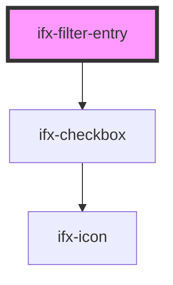

# ifx-filter-entry

<!-- Auto Generated Below -->

## Properties

| Property      | Attribute      | Description | Type      | Default     |
| ------------- | -------------- | ----------- | --------- | ----------- |
| `filterName`  | `filter-name`  |             | `string`  | `undefined` |
| `filterValue` | `filter-value` |             | `boolean` | `undefined` |

## Events

| Event                  | Description | Type               |
| ---------------------- | ----------- | ------------------ |
| `ifxFilterEntryChange` |             | `CustomEvent<any>` |

## Dependencies

### Depends on

- [ifx-checkbox](../checkbox)

### Graph

----------------------------------------------

*Built with [StencilJS](https://stenciljs.com/)*
