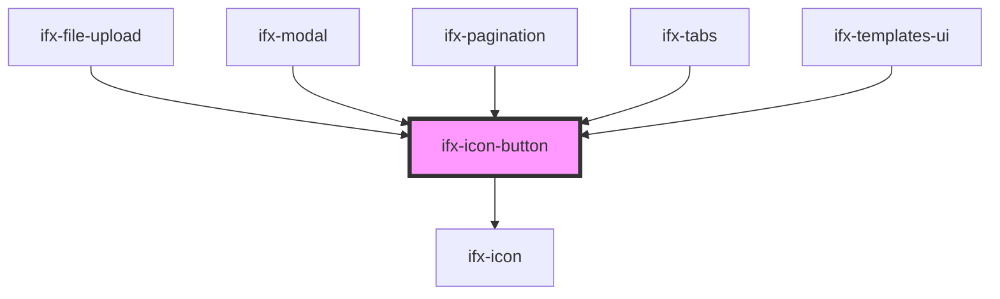

# ifx-icon-button

<!-- Auto Generated Below -->

## Properties

| Property    | Attribute    | Description | Type                                     | Default     |
| ----------- | ------------ | ----------- | ---------------------------------------- | ----------- |
| `ariaLabel` | `aria-label` |             | `string`                                 | `undefined` |
| `disabled`  | `disabled`   |             | `boolean`                                | `undefined` |
| `href`      | `href`       |             | `string`                                 | `undefined` |
| `icon`      | `icon`       |             | `string`                                 | `undefined` |
| `shape`     | `shape`      |             | `string`                                 | `"round"`   |
| `size`      | `size`       |             | `string`                                 | `undefined` |
| `target`    | `target`     |             | `string`                                 | `"_self"`   |
| `variant`   | `variant`    |             | `"primary" \| "secondary" \| "tertiary"` | `undefined` |

## Methods

### `setFocus() => Promise<void>`

#### Returns

Type: `Promise<void>`

## Dependencies

### Used by

 - [ifx-file-upload](../file-upload)
 - [ifx-modal](../modal)
 - [ifx-pagination](../pagination)
 - [ifx-tabs](../tabs)
 - [ifx-templates-ui](../templates/templates-ui)

### Depends on

- [ifx-icon](../icon)

### Graph

----------------------------------------------

*Built with [StencilJS](https://stenciljs.com/)*
