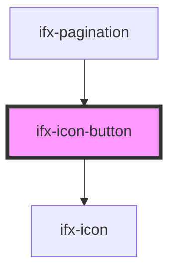

# ifx-icon-button

<!-- Auto Generated Below -->

## Properties

| Property   | Attribute  | Description | Type                                   | Default     |
| ---------- | ---------- | ----------- | -------------------------------------- | ----------- |
| `disabled` | `disabled` |             | `boolean`                              | `undefined` |
| `href`     | `href`     |             | `string`                               | `undefined` |
| `icon`     | `icon`     |             | `string`                               | `undefined` |
| `shape`    | `shape`    |             | `string`                               | `'round'`   |
| `size`     | `size`     |             | `string`                               | `undefined` |
| `target`   | `target`   |             | `string`                               | `'_self'`   |
| `variant`  | `variant`  |             | `"secondary" \| "solid" \| "tertiary"` | `undefined` |

## Methods

### `setFocus() => Promise<void>`

#### Returns

Type: `Promise<void>`

## Dependencies

### Used by

 - [ifx-pagination](../pagination)

### Depends on

- [ifx-icon](../icon)

### Graph

----------------------------------------------

*Built with [StencilJS](https://stenciljs.com/)*
