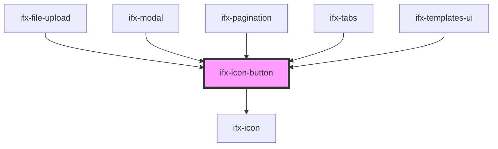

# ifx-icon-button

<!-- Auto Generated Below -->

## Properties

| Property        | Attribute         | Description                                        | Type                                     | Default     |
| --------------- | ----------------- | -------------------------------------------------- | ---------------------------------------- | ----------- |
| `ariaLabelText` | `aria-label-text` | Accessible albel for screen readers.               | `string`                                 | `undefined` |
| `disabled`      | `disabled`        | If true, the button is disabled and not clickable. | `boolean`                                | `undefined` |
| `href`          | `href`            | URL the button should navigate to when clicked.    | `string`                                 | `undefined` |
| `icon`          | `icon`            | Name or identifier of the icon to display.         | `string`                                 | `undefined` |
| `shape`         | `shape`           | Shape of the button.                               | `string`                                 | `"round"`   |
| `size`          | `size`            | Size of the icon button.                           | `string`                                 | `undefined` |
| `target`        | `target`          | Where to open the link.                            | `string`                                 | `"_self"`   |
| `variant`       | `variant`         | Visual style of the icon button.                   | `"primary" \| "secondary" \| "tertiary"` | `undefined` |

## Methods

### `setFocus() => Promise<void>`

Moves keyboard focus to the internal focusable element.

#### Returns

Type: `Promise<void>`

## Dependencies

### Used by

 - [ifx-file-upload](../file-upload)
 - [ifx-modal](../modal)
 - [ifx-pagination](../pagination)
 - [ifx-tabs](../tabs)
 - [ifx-templates-ui](../templates/templates-ui)

### Depends on

- [ifx-icon](../icon)

### Graph

```mermaid
graph TD;
  ifx-icon-button --> ifx-icon
  ifx-file-upload --> ifx-icon-button
  ifx-modal --> ifx-icon-button
  ifx-pagination --> ifx-icon-button
  ifx-tabs --> ifx-icon-button
  ifx-templates-ui --> ifx-icon-button
  style ifx-icon-button fill:#f9f,stroke:#333,stroke-width:4px
```

----------------------------------------------

*Built with [StencilJS](https://stenciljs.com/)*
