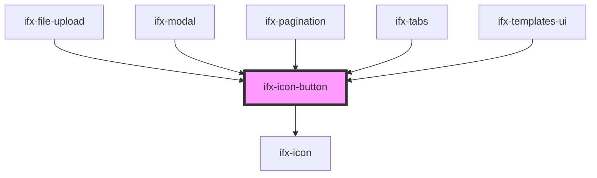

# ifx-icon-button

<!-- Auto Generated Below -->

## Properties

| Property        | Attribute         | Description                                                                                                                                                                                              | Type                                     | Default     |
| --------------- | ----------------- | -------------------------------------------------------------------------------------------------------------------------------------------------------------------------------------------------------- | ---------------------------------------- | ----------- |
| `ariaLabelText` | `aria-label-text` | Accessible name announced by assistive technologies.                                                                                                                                                     | `string`                                 | `undefined` |
| `disabled`      | `disabled`        | Disables the button and blocks user interaction.                                                                                                                                                         | `boolean`                                | `false`     |
| `href`          | `href`            | URL to navigate to; when provided, the component renders as a link.                                                                                                                                      | `string`                                 | `undefined` |
| `icon`          | `icon`            | Icon name rendered by the nested `ifx-icon`. Refer to the [Icon Library](https://infineon.github.io/infineon-design-system-stencil/storybook/?path=/docs/icon-library--development) for available icons. | `string`                                 | `undefined` |
| `shape`         | `shape`           | Visual shape of the icon button.                                                                                                                                                                         | `"round" \| "square"`                    | `"round"`   |
| `size`          | `size`            | Size of the icon button. Options: xs (20px), s (32px), m (36px) and l (40px).                                                                                                                            | `"l" \| "m" \| "s" \| "xs"`              | `"m"`       |
| `target`        | `target`          | Target for link navigation when `href` is set.                                                                                                                                                           | `string`                                 | `"_self"`   |
| `variant`       | `variant`         | Visual style of the icon button. Primary has a solid background, secondary has an outline and tertiary is just the icon with no background or border.                                                    | `"primary" \| "secondary" \| "tertiary"` | `"primary"` |

## Methods

### `setFocus() => Promise<void>`

Sets focus on the icon button. If the button is rendered as a link, it focuses the anchor element; otherwise, it focuses the button element.

#### Returns

Type: `Promise<void>`

## Dependencies

### Used by

 - [ifx-file-upload](../file-upload)
 - [ifx-modal](../modal)
 - [ifx-pagination](../pagination)
 - [ifx-tabs](../tabs)
 - [ifx-templates-ui](../templates/templates-ui)

### Depends on

- [ifx-icon](../icon)

### Graph

```mermaid
graph TD;
  ifx-icon-button --> ifx-icon
  ifx-file-upload --> ifx-icon-button
  ifx-modal --> ifx-icon-button
  ifx-pagination --> ifx-icon-button
  ifx-tabs --> ifx-icon-button
  ifx-templates-ui --> ifx-icon-button
  style ifx-icon-button fill:#f9f,stroke:#333,stroke-width:4px
```

----------------------------------------------

*Built with [StencilJS](https://stenciljs.com/)*
