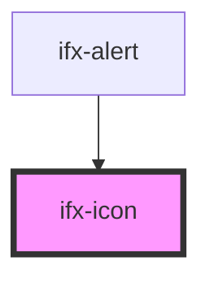

# ifx-icon

<!-- Auto Generated Below -->

## Properties

| Property  | Attribute  | Description | Type     | Default     |
| --------- | ---------- | ----------- | -------- | ----------- |
| `icon`    | `icon`     |             | `string` | `""`        |
| `ifxIcon` | `ifx-icon` |             | `any`    | `undefined` |

## Events

| Event          | Description | Type                   |
| -------------- | ----------- | ---------------------- |
| `consoleError` |             | `CustomEvent<boolean>` |

## Dependencies

### Used by

 - [ifx-alert](../alert)

### Graph

----------------------------------------------

*Built with [StencilJS](https://stenciljs.com/)*
