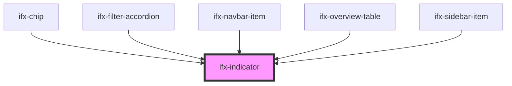

# ifx-indicator

<!-- Auto Generated Below -->

## Properties

| Property    | Attribute    | Description | Type      | Default     |
| ----------- | ------------ | ----------- | --------- | ----------- |
| `ariaLabel` | `aria-label` |             | `string`  | `undefined` |
| `inverted`  | `inverted`   |             | `boolean` | `false`     |
| `number`    | `number`     |             | `number`  | `0`         |
| `variant`   | `variant`    |             | `string`  | `"number"`  |

## Dependencies

### Used by

 - [ifx-chip](../chip)
 - [ifx-filter-accordion](../table-advanced-version/filter-type-group/filter-accordion)
 - [ifx-navbar-item](../navigation/navbar)
 - [ifx-overview-table](../overview-table)
 - [ifx-sidebar-item](../navigation/sidebar)

### Graph

----------------------------------------------

*Built with [StencilJS](https://stenciljs.com/)*
