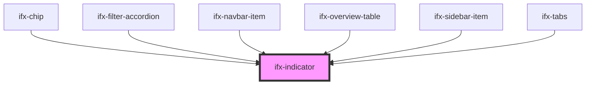

# ifx-indicator

<!-- Auto Generated Below -->

## Properties

| Property      | Attribute      | Description                                                                       | Type      | Default     |
| ------------- | -------------- | --------------------------------------------------------------------------------- | --------- | ----------- |
| `ariaLabeled` | `aria-labeled` | Provide a short, descriptive text that explains the indicator's meaning or value. | `string`  | `undefined` |
| `disabled`    | `disabled`     | Disables the indicator's interactions.                                            | `boolean` | `false`     |
| `inverted`    | `inverted`     | Renders the indicator with an inverted color scheme for dark backgrounds.         | `boolean` | `false`     |
| `number`      | `number`       | Numeric value to display when using the 'number' variant                          | `number`  | `0`         |
| `variant`     | `variant`      | Sets variant of the Indicator                                                     | `string`  | `'number'`  |

## Dependencies

### Used by

 - [ifx-chip](../chip)
 - [ifx-filter-accordion](../table-advanced-version/filter-type-group/filter-accordion)
 - [ifx-navbar-item](../navigation/navbar)
 - [ifx-overview-table](../overview-table)
 - [ifx-sidebar-item](../navigation/sidebar)
 - [ifx-tabs](../tabs)

### Graph

----------------------------------------------

*Built with [StencilJS](https://stenciljs.com/)*
