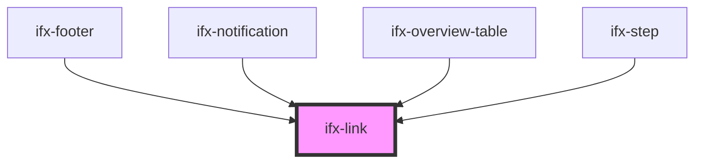

# ifx-link

<!-- Auto Generated Below -->

## Properties

| Property   | Attribute  | Description | Type      | Default     |
| ---------- | ---------- | ----------- | --------- | ----------- |
| `disabled` | `disabled` |             | `boolean` | `false`     |
| `href`     | `href`     |             | `string`  | `undefined` |
| `size`     | `size`     |             | `string`  | `undefined` |
| `target`   | `target`   |             | `string`  | `'_self'`   |
| `variant`  | `variant`  |             | `string`  | `'bold'`    |

## Dependencies

### Used by

 - [ifx-footer](../footer)
 - [ifx-notification](../notification)
 - [ifx-overview-table](../overview-table)
 - [ifx-step](../stepper/step)

### Graph

----------------------------------------------

*Built with [StencilJS](https://stenciljs.com/)*
