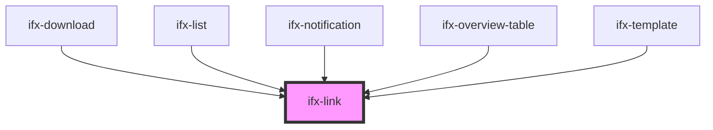

# ifx-link

<!-- Auto Generated Below -->

## Properties

| Property        | Attribute         | Description                                                 | Type                                          | Default     |
| --------------- | ----------------- | ----------------------------------------------------------- | --------------------------------------------- | ----------- |
| `ariaLabelText` | `aria-label-text` | Accessible label announced by assistive technologies.       | `string`                                      | `undefined` |
| `disabled`      | `disabled`        | Disables interaction.                                       | `boolean`                                     | `false`     |
| `download`      | `download`        | Optional filename or download hint for the linked resource. | `string`                                      | `undefined` |
| `href`          | `href`            | URL the link navigates to.                                  | `string`                                      | `undefined` |
| `size`          | `size`            | Font size of the link.                                      | `"l" \| "m" \| "s" \| "xl"`                   | `"m"`       |
| `target`        | `target`          | Target window for the link.                                 | `string`                                      | `"_self"`   |
| `variant`       | `variant`         | Visual style variant of the link.                           | `"bold" \| "menu" \| "title" \| "underlined"` | `"bold"`    |

## Dependencies

### Used by

 - [ifx-download](../download)
 - [ifx-list](../table-advanced-version/list)
 - [ifx-notification](../notification)
 - [ifx-overview-table](../overview-table)
 - [ifx-template](../templates/template)

### Graph

```mermaid
graph TD;
  ifx-download --> ifx-link
  ifx-list --> ifx-link
  ifx-notification --> ifx-link
  ifx-overview-table --> ifx-link
  ifx-template --> ifx-link
  style ifx-link fill:#f9f,stroke:#333,stroke-width:4px
```

----------------------------------------------

*Built with [StencilJS](https://stenciljs.com/)*
