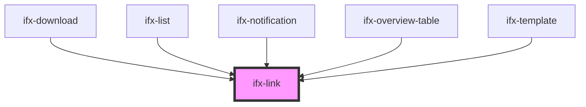

# ifx-link

<!-- Auto Generated Below -->

## Properties

| Property    | Attribute    | Description                                              | Type      | Default     |
| ----------- | ------------ | -------------------------------------------------------- | --------- | ----------- |
| `ariaLabel` | `aria-label` | Accessible label for screen readers                      | `string`  | `undefined` |
| `disabled`  | `disabled`   | If true, the link looks disabled and is not interactive. | `boolean` | `false`     |
| `download`  | `download`   | Filename to use when the linke us used for downloading.  | `string`  | `undefined` |
| `href`      | `href`       | URL the link should navigate to when clicked.            | `string`  | `undefined` |
| `size`      | `size`       | Size of the link text.                                   | `string`  | `undefined` |
| `target`    | `target`     | Where to open the link.                                  | `string`  | `"_self"`   |
| `variant`   | `variant`    | Visual style of the link text.                           | `string`  | `"bold"`    |

## Dependencies

### Used by

 - [ifx-download](../download)
 - [ifx-list](../table-advanced-version/list)
 - [ifx-notification](../notification)
 - [ifx-overview-table](../overview-table)
 - [ifx-template](../templates/template)

### Graph

```mermaid
graph TD;
  ifx-download --> ifx-link
  ifx-list --> ifx-link
  ifx-notification --> ifx-link
  ifx-overview-table --> ifx-link
  ifx-template --> ifx-link
  style ifx-link fill:#f9f,stroke:#333,stroke-width:4px
```

----------------------------------------------

*Built with [StencilJS](https://stenciljs.com/)*
