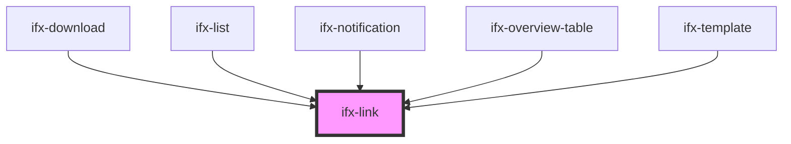

# ifx-link

<!-- Auto Generated Below -->

## Properties

| Property    | Attribute    | Description | Type      | Default     |
| ----------- | ------------ | ----------- | --------- | ----------- |
| `ariaLabel` | `aria-label` |             | `string`  | `undefined` |
| `disabled`  | `disabled`   |             | `boolean` | `false`     |
| `download`  | `download`   |             | `string`  | `undefined` |
| `href`      | `href`       |             | `string`  | `undefined` |
| `size`      | `size`       |             | `string`  | `undefined` |
| `target`    | `target`     |             | `string`  | `"_self"`   |
| `variant`   | `variant`    |             | `string`  | `"bold"`    |

## Dependencies

### Used by

 - [ifx-download](../download)
 - [ifx-list](../table-advanced-version/list)
 - [ifx-notification](../notification)
 - [ifx-overview-table](../overview-table)
 - [ifx-template](../templates/template)

### Graph

----------------------------------------------

*Built with [StencilJS](https://stenciljs.com/)*
