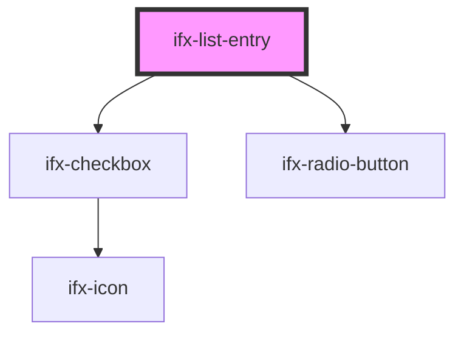

# ifx-list-entry

<!-- Auto Generated Below -->

## Properties

| Property | Attribute | Description | Type      | Default     |
| -------- | --------- | ----------- | --------- | ----------- |
| `label`  | `label`   |             | `string`  | `undefined` |
| `type`   | `type`    |             | `string`  | `undefined` |
| `value`  | `value`   |             | `boolean` | `undefined` |

## Events

| Event                | Description | Type               |
| -------------------- | ----------- | ------------------ |
| `ifxListEntryChange` |             | `CustomEvent<any>` |

## Dependencies

### Depends on

- [ifx-checkbox](../../checkbox)
- [ifx-radio-button](../../radio-button)

### Graph

----------------------------------------------

*Built with [StencilJS](https://stenciljs.com/)*
