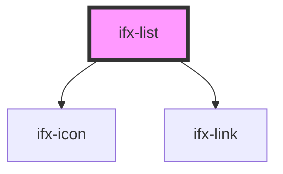

# ifx-list

<!-- Auto Generated Below -->

## Properties

| Property          | Attribute           | Description | Type     | Default |
| ----------------- | ------------------- | ----------- | -------- | ------- |
| `maxVisibleItems` | `max-visible-items` |             | `number` | `6`     |
| `name`            | `name`              |             | `string` | `""`    |

## Events

| Event           | Description | Type               |
| --------------- | ----------- | ------------------ |
| `ifxListUpdate` |             | `CustomEvent<any>` |

## Dependencies

### Depends on

- [ifx-icon](../icon)
- [ifx-link](../link)

### Graph

----------------------------------------------

*Built with [StencilJS](https://stenciljs.com/)*
