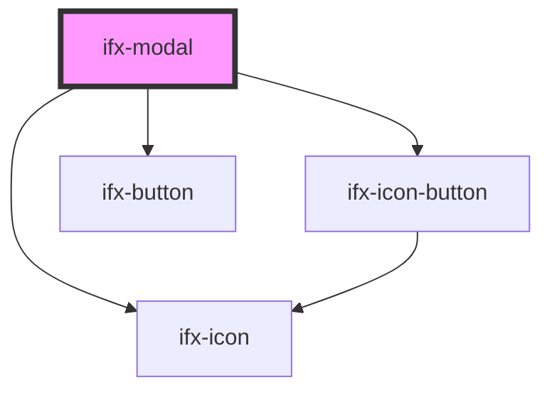

# ifx-tag

<!-- Auto Generated Below -->

## Properties

| Property              | Attribute                | Description | Type                                                                               | Default         |
| --------------------- | ------------------------ | ----------- | ---------------------------------------------------------------------------------- | --------------- |
| `alertColor`          | `alert-color`            |             | `"" \| "berry" \| "green" \| "grey" \| "grey-200" \| "ocean" \| "orange" \| "red"` | `''`            |
| `alertIcon`           | `alert-icon`             |             | `string`                                                                           | `''`            |
| `cancelButtonLabel`   | `cancel-button-label`    |             | `string`                                                                           | `'Cancel'`      |
| `caption`             | `caption`                |             | `string`                                                                           | `'Modal Title'` |
| `closeOnOverlayClick` | `close-on-overlay-click` |             | `boolean`                                                                          | `true`          |
| `okButtonLabel`       | `ok-button-label`        |             | `string`                                                                           | `'OK'`          |
| `variant`             | `variant`                |             | `"alert-brand" \| "alert-danger" \| "default"`                                     | `'default'`     |

## Events

| Event              | Description | Type               |
| ------------------ | ----------- | ------------------ |
| `closeButtonClick` |             | `CustomEvent<any>` |
| `modalClose`       |             | `CustomEvent<any>` |
| `modalOpen`        |             | `CustomEvent<any>` |

## Methods

### `close() => Promise<void>`

#### Returns

Type: `Promise<void>`

### `open() => Promise<void>`

#### Returns

Type: `Promise<void>`

## Dependencies

### Depends on

- [ifx-icon](../icon)
- [ifx-icon-button](../icon-button)
- [ifx-button](../button)

### Graph

----------------------------------------------

*Built with [StencilJS](https://stenciljs.com/)*
