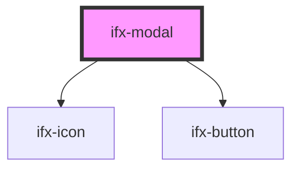

# ifx-tag

<!-- Auto Generated Below -->

## Properties

| Property              | Attribute                | Description | Type                                                                               | Default         |
| --------------------- | ------------------------ | ----------- | ---------------------------------------------------------------------------------- | --------------- |
| `alertColor`          | `alert-color`            |             | `"" \| "berry" \| "green" \| "grey" \| "grey-200" \| "ocean" \| "orange" \| "red"` | `''`            |
| `alertIcon`           | `alert-icon`             |             | `string`                                                                           | `''`            |
| `caption`             | `caption`                |             | `string`                                                                           | `'Modal Title'` |
| `closeOnOverlayClick` | `close-on-overlay-click` |             | `boolean`                                                                          | `true`          |

## Events

| Event               | Description | Type               |
| ------------------- | ----------- | ------------------ |
| `cancelButtonClick` |             | `CustomEvent<any>` |
| `modalClose`        |             | `CustomEvent<any>` |
| `modalOpen`         |             | `CustomEvent<any>` |
| `okButtonClick`     |             | `CustomEvent<any>` |

## Methods

### `close() => Promise<void>`

#### Returns

Type: `Promise<void>`

### `open() => Promise<void>`

#### Returns

Type: `Promise<void>`

## Dependencies

### Depends on

- [ifx-icon](../icon)
- [ifx-button](../button)

### Graph

----------------------------------------------

*Built with [StencilJS](https://stenciljs.com/)*
