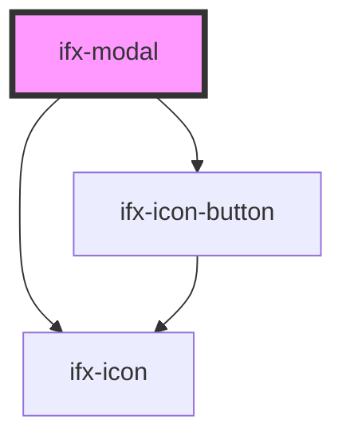

# ifx-tag

<!-- Auto Generated Below -->

## Properties

| Property              | Attribute                | Description | Type                                           | Default         |
| --------------------- | ------------------------ | ----------- | ---------------------------------------------- | --------------- |
| `alertIcon`           | `alert-icon`             |             | `string`                                       | `''`            |
| `cancelButtonLabel`   | `cancel-button-label`    |             | `string`                                       | `'Cancel'`      |
| `caption`             | `caption`                |             | `string`                                       | `'Modal Title'` |
| `closeOnOverlayClick` | `close-on-overlay-click` |             | `boolean`                                      | `true`          |
| `okButtonLabel`       | `ok-button-label`        |             | `string`                                       | `'OK'`          |
| `opened`              | `opened`                 |             | `boolean`                                      | `false`         |
| `showCloseButton`     | `show-close-button`      |             | `boolean`                                      | `true`          |
| `variant`             | `variant`                |             | `"alert-brand" \| "alert-danger" \| "default"` | `'default'`     |
| `width`               | `width`                  |             | `"l" \| "m" \| "s"`                            | `'s'`           |

## Events

| Event           | Description | Type               |
| --------------- | ----------- | ------------------ |
| `ifxModalClose` |             | `CustomEvent<any>` |
| `ifxModalOpen`  |             | `CustomEvent<any>` |

## Dependencies

### Depends on

- [ifx-icon](../icon)
- [ifx-icon-button](../icon-button)

### Graph

----------------------------------------------

*Built with [StencilJS](https://stenciljs.com/)*
