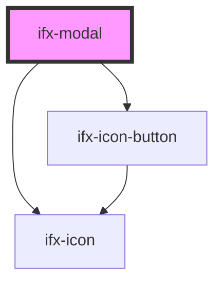

# ifx-tag

<!-- Auto Generated Below -->

## Properties

| Property               | Attribute                 | Description                                                                                                                                                                                                                                                     | Type                                           | Default         |
| ---------------------- | ------------------------- | --------------------------------------------------------------------------------------------------------------------------------------------------------------------------------------------------------------------------------------------------------------- | ---------------------------------------------- | --------------- |
| `alertIcon`            | `alert-icon`              | Allows the display of a specific icon in the modal header when the variant is set to an alert type. Refer to the [Icon Library](https://infineon.github.io/infineon-design-system-stencil/storybook/?path=/docs/icon-library--development) for available icons. | `string`                                       | `""`            |
| `caption`              | `caption`                 | The title text displayed in the modal header. This should be a concise description of the modal's purpose.                                                                                                                                                      | `string`                                       | `"Modal Title"` |
| `captionAriaLabel`     | `caption-aria-label`      | Provides an accessible label for the modal caption, enhancing screen reader support. If not provided, the `caption` prop will be used as the accessible name.                                                                                                   | `string`                                       | `undefined`     |
| `closeButtonAriaLabel` | `close-button-aria-label` | Provides an accessible label for the close button, enhancing screen reader support. If not provided, a default label of "Close modal" will be used.                                                                                                             | `string`                                       | `"Close modal"` |
| `closeOnOverlayClick`  | `close-on-overlay-click`  | Determines whether clicking on the overlay (backdrop) will close the modal.                                                                                                                                                                                     | `boolean`                                      | `true`          |
| `opened`               | `opened`                  | Controls the visibility of the modal. Can be used for both declarative and programmatic control.                                                                                                                                                                | `boolean`                                      | `false`         |
| `showCloseButton`      | `show-close-button`       | Controls the visibility of the close button in the modal header.                                                                                                                                                                                                | `boolean`                                      | `true`          |
| `size`                 | `size`                    | Specifies the size of the modal, allowing it to adapt to different content needs and screen sizes.                                                                                                                                                              | `"l" \| "m" \| "s"`                            | `"s"`           |
| `variant`              | `variant`                 | Defines the visual style of the modal, indicating its purpose or importance.                                                                                                                                                                                    | `"alert-brand" \| "alert-danger" \| "default"` | `"default"`     |

## Events

| Event             | Description                                                                                                                                                                                                               | Type                                |
| ----------------- | ------------------------------------------------------------------------------------------------------------------------------------------------------------------------------------------------------------------------- | ----------------------------------- |
| `ifxClose`        | Emitted when the modal finishes closing and the closing animation completes. No additional data is provided with this event.                                                                                              | `CustomEvent<any>`                  |
| `ifxOpen`         | Emitted when the modal finishes opening and the opening animation completes. No additional data is provided with this event.                                                                                              | `CustomEvent<any>`                  |
| `ifxOpenedChange` | Emitted immediately when the `opened` state changes (before animations). The event detail contains `{ opened: boolean }` with the new state. Use this event for two-way binding (v-model in Vue, [(ngModel)] in Angular). | `CustomEvent<{ opened: boolean; }>` |

## Dependencies

### Depends on

- [ifx-icon](../icon)
- [ifx-icon-button](../icon-button)

### Graph

```mermaid
graph TD;
  ifx-modal --> ifx-icon
  ifx-modal --> ifx-icon-button
  ifx-icon-button --> ifx-icon
  style ifx-modal fill:#f9f,stroke:#333,stroke-width:4px
```

----------------------------------------------

*Built with [StencilJS](https://stenciljs.com/)*
