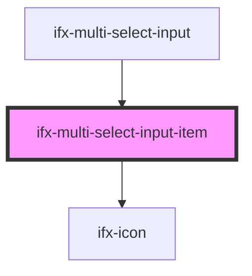

# ifx-multi-select-input-item

<!-- Auto Generated Below -->

## Properties

| Property  | Attribute | Description | Type     | Default |
| --------- | --------- | ----------- | -------- | ------- |
| `content` | `content` |             | `string` | `""`    |

## Events

| Event    | Description | Type                   |
| -------- | ----------- | ---------------------- |
| `closed` |             | `CustomEvent<boolean>` |

## Dependencies

### Used by

 - [ifx-multi-select-input](.)

### Depends on

- [ifx-icon](../icon)

### Graph

----------------------------------------------

*Built with [StencilJS](https://stenciljs.com/)*
