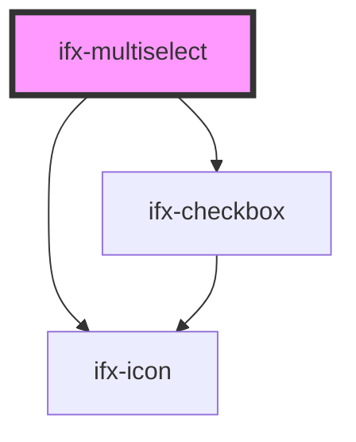

# ifx-multiselect

<!-- Auto Generated Below -->

## Properties

| Property       | Attribute        | Description | Type                                            | Default           |
| -------------- | ---------------- | ----------- | ----------------------------------------------- | ----------------- |
| `disabled`     | `disabled`       |             | `boolean`                                       | `false`           |
| `maxItemCount` | `max-item-count` |             | `number`                                        | `10`              |
| `options`      | `options`        |             | `string \| { value: string; label: string; }[]` | `undefined`       |
| `size`         | `size`           |             | `string`                                        | `'medium (40px)'` |

## Events

| Event                  | Description | Type               |
| ---------------------- | ----------- | ------------------ |
| `ifxMultiselectIsOpen` |             | `CustomEvent<any>` |
| `ifxSelect`            |             | `CustomEvent<any>` |

## Dependencies

### Depends on

- [ifx-checkbox](../checkbox)
- [ifx-icon](../icon)

### Graph

----------------------------------------------

*Built with [StencilJS](https://stenciljs.com/)*
