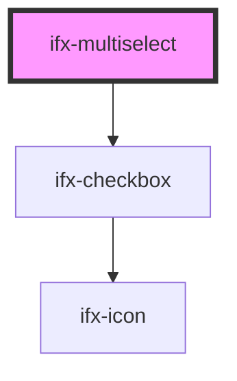

# ifx-multiselect

<!-- Auto Generated Below -->

## Properties

| Property  | Attribute | Description | Type                                            | Default     |
| --------- | --------- | ----------- | ----------------------------------------------- | ----------- |
| `options` | `options` |             | `string \| { value: string; label: string; }[]` | `undefined` |

## Events

| Event                  | Description | Type               |
| ---------------------- | ----------- | ------------------ |
| `ifxMultiselectIsOpen` |             | `CustomEvent<any>` |
| `ifxSelect`            |             | `CustomEvent<any>` |

## Dependencies

### Depends on

- [ifx-checkbox](../checkbox)

### Graph

----------------------------------------------

*Built with [StencilJS](https://stenciljs.com/)*
