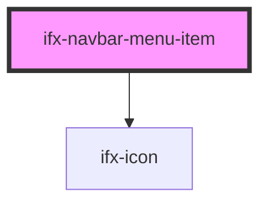

# ifx-navbar-menu-item

<!-- Auto Generated Below -->

## Properties

| Property    | Attribute    | Description | Type      | Default      |
| ----------- | ------------ | ----------- | --------- | ------------ |
| `hideLabel` | `hide-label` |             | `boolean` | `false`      |
| `icon`      | `icon`       |             | `string`  | `"image-16"` |
| `isProfile` | `is-profile` |             | `boolean` | `false`      |

## Dependencies

### Depends on

- [ifx-icon](../icon)

### Graph

----------------------------------------------

*Built with [StencilJS](https://stenciljs.com/)*
