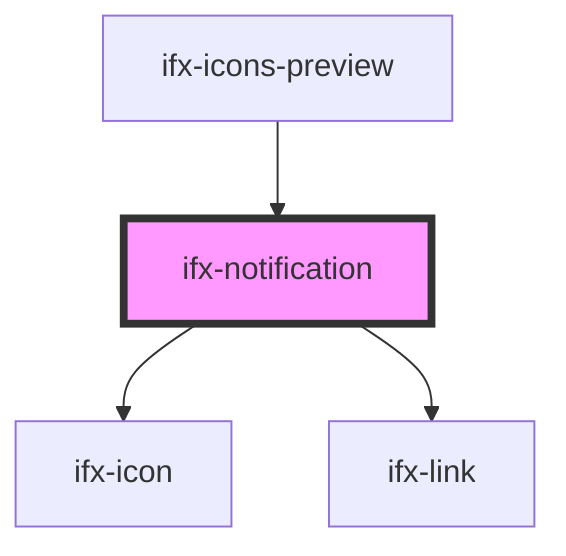

# ifx-notification

<!-- Auto Generated Below -->

## Properties

| Property     | Attribute     | Description                                             | Type                                            | Default     |
| ------------ | ------------- | ------------------------------------------------------- | ----------------------------------------------- | ----------- |
| `icon`       | `icon`        | Icon to display in the notification.                    | `string`                                        | `undefined` |
| `linkHref`   | `link-href`   | URL the notification link should navigate to.           | `string`                                        | `undefined` |
| `linkTarget` | `link-target` | Where to open the link (same tab, new tab, etc.).       | `string`                                        | `"_blank"`  |
| `linkText`   | `link-text`   | Text for the optional action link.                      | `string`                                        | `undefined` |
| `variant`    | `variant`     | Visual style of the notification (e.g. success, error). | `"error" \| "locked" \| "neutral" \| "success"` | `"success"` |

## Dependencies

### Used by

 - [ifx-icons-preview](../icons-preview)

### Depends on

- [ifx-icon](../icon)
- [ifx-link](../link)

### Graph

```mermaid
graph TD;
  ifx-notification --> ifx-icon
  ifx-notification --> ifx-link
  ifx-icons-preview --> ifx-notification
  style ifx-notification fill:#f9f,stroke:#333,stroke-width:4px
```

----------------------------------------------

*Built with [StencilJS](https://stenciljs.com/)*
