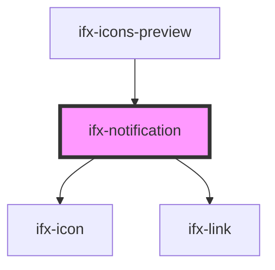

# ifx-notification

<!-- Auto Generated Below -->

## Properties

| Property     | Attribute     | Description | Type                                            | Default     |
| ------------ | ------------- | ----------- | ----------------------------------------------- | ----------- |
| `icon`       | `icon`        |             | `string`                                        | `undefined` |
| `linkHref`   | `link-href`   |             | `string`                                        | `undefined` |
| `linkTarget` | `link-target` |             | `string`                                        | `"_blank"`  |
| `linkText`   | `link-text`   |             | `string`                                        | `undefined` |
| `variant`    | `variant`     |             | `"error" \| "locked" \| "neutral" \| "success"` | `"success"` |

## Dependencies

### Used by

 - [ifx-icons-preview](../icons-preview)

### Depends on

- [ifx-icon](../icon)
- [ifx-link](../link)

### Graph

----------------------------------------------

*Built with [StencilJS](https://stenciljs.com/)*
