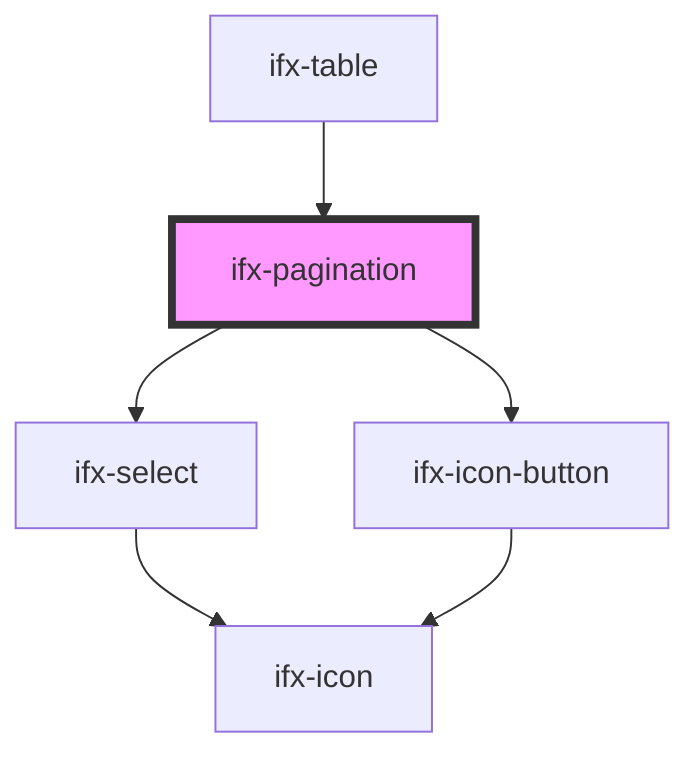

# ifx-pagination

<!-- Auto Generated Below -->

## Properties

| Property           | Attribute             | Description | Type              | Default     |
| ------------------ | --------------------- | ----------- | ----------------- | ----------- |
| `currentPage`      | `current-page`        |             | `number`          | `1`         |
| `itemsPerPage`     | `items-per-page`      |             | `any[] \| string` | `undefined` |
| `showItemsPerPage` | `show-items-per-page` |             | `boolean`         | `true`      |
| `total`            | `total`               |             | `number`          | `1`         |

## Events

| Event                   | Description | Type               |
| ----------------------- | ----------- | ------------------ |
| `ifxItemsPerPageChange` |             | `CustomEvent<any>` |
| `ifxPageChange`         |             | `CustomEvent<any>` |

## Dependencies

### Used by

 - [ifx-table](../table-advanced-version)

### Depends on

- [ifx-select](../select/single-select)
- [ifx-icon-button](../icon-button)

### Graph

----------------------------------------------

*Built with [StencilJS](https://stenciljs.com/)*
