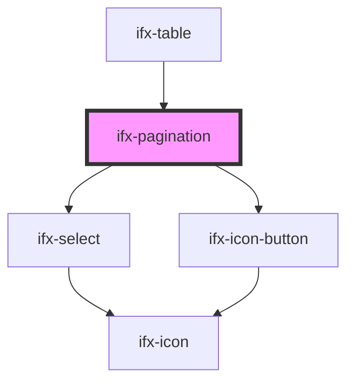

# ifx-pagination

<!-- Auto Generated Below -->

## Properties

| Property            | Attribute              | Description                                     | Type              | Default     |
| ------------------- | ---------------------- | ----------------------------------------------- | ----------------- | ----------- |
| `currentPage`       | `current-page`         | The current page number passed from the outside | `number`          | `1`         |
| `itemsPerPage`      | `items-per-page`       | Items-per-page options                          | `any[] \| string` | `undefined` |
| `itemsPerPageLabel` | `items-per-page-label` |                                                 | `string`          | `undefined` |
| `showItemsPerPage`  | `show-items-per-page`  | Wether to display the items-per-page selector   | `boolean`         | `true`      |
| `total`             | `total`                | Total number of items to paginate               | `number`          | `1`         |

## Events

| Event                   | Description                                   | Type               |
| ----------------------- | --------------------------------------------- | ------------------ |
| `ifxItemsPerPageChange` | Emitted when the items-per-page value changes | `CustomEvent<any>` |
| `ifxPageChange`         | Emitted when the current page changes         | `CustomEvent<any>` |

## Dependencies

### Used by

 - [ifx-table](../table-advanced-version)

### Depends on

- [ifx-select](../select/single-select)
- [ifx-icon-button](../icon-button)

### Graph

```mermaid
graph TD;
  ifx-pagination --> ifx-select
  ifx-pagination --> ifx-icon-button
  ifx-select --> ifx-icon
  ifx-icon-button --> ifx-icon
  ifx-table --> ifx-pagination
  style ifx-pagination fill:#f9f,stroke:#333,stroke-width:4px
```

----------------------------------------------

*Built with [StencilJS](https://stenciljs.com/)*
