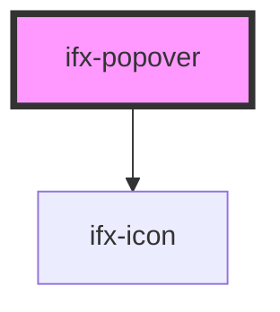

# ifx-popover

<!-- Auto Generated Below -->

## Properties

| Property       | Attribute       | Description                                             | Type                                                                                                             | Default  |
| -------------- | --------------- | ------------------------------------------------------- | ---------------------------------------------------------------------------------------------------------------- | -------- |
| `ariaLabel`    | `aria-label`    | Accessible label for the popover                        | `string`                                                                                                         | `null`   |
| `disabled`     | `disabled`      | Whether the popover is disabled                         | `boolean`                                                                                                        | `false`  |
| `open`         | `open`          | Whether the popover is initially open                   | `boolean`                                                                                                        | `false`  |
| `popoverTitle` | `popover-title` | Title text displayed in the popover header              | `string`                                                                                                         | `''`     |
| `position`     | `position`      | Position of the popover relative to the trigger element | `"auto" \| "bottom" \| "bottom-end" \| "bottom-start" \| "left" \| "right" \| "top" \| "top-end" \| "top-start"` | `'auto'` |
| `text`         | `text`          | Body text displayed in the popover content              | `string`                                                                                                         | `''`     |

## Events

| Event      | Description                        | Type                                     |
| ---------- | ---------------------------------- | ---------------------------------------- |
| `ifxClose` |                                    | `CustomEvent<any>`                       |
| `ifxOpen`  | Emitted when the popover is opened | `CustomEvent<{ trigger: HTMLElement; }>` |

## Methods

### `hide() => Promise<void>`

Programmatically hide the popover

#### Returns

Type: `Promise<void>`

### `show() => Promise<void>`

Programmatically show the popover

#### Returns

Type: `Promise<void>`

### `toggle() => Promise<void>`

Programmatically toggle the popover visibility

#### Returns

Type: `Promise<void>`

## Dependencies

### Depends on

- [ifx-icon](../icon)

### Graph

----------------------------------------------

*Built with [StencilJS](https://stenciljs.com/)*
