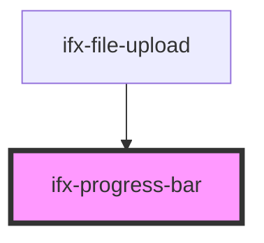

# progress-bar

<!-- Auto Generated Below -->

## Properties

| Property    | Attribute    | Description                                                     | Type      | Default     |
| ----------- | ------------ | --------------------------------------------------------------- | --------- | ----------- |
| `showLabel` | `show-label` | Whether to show a text label next to the progress bar.          | `boolean` | `false`     |
| `size`      | `size`       | Size of the progress bar (e.g. small, medium, large).           | `string`  | `undefined` |
| `value`     | `value`      | Current value of the progress bar (e.g. completion percentage). | `number`  | `0`         |

## Dependencies

### Used by

 - [ifx-file-upload](../file-upload)

### Graph

----------------------------------------------

*Built with [StencilJS](https://stenciljs.com/)*
