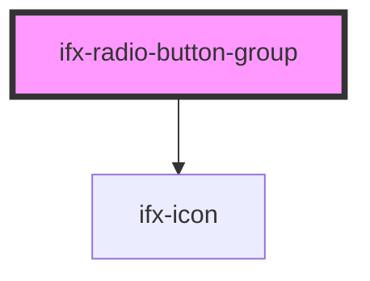

# ifx-radio-button-group

<!-- Auto Generated Below -->

## Properties

| Property          | Attribute           | Description | Type                         | Default              |
| ----------------- | ------------------- | ----------- | ---------------------------- | -------------------- |
| `alignment`       | `alignment`         |             | `"horizontal" \| "vertical"` | `"vertical"`         |
| `captionText`     | `caption-text`      |             | `string`                     | `undefined`          |
| `groupLabelText`  | `group-label-text`  |             | `string`                     | `"Group Label Text"` |
| `required`        | `required`          |             | `boolean`                    | `false`              |
| `showCaption`     | `show-caption`      |             | `boolean`                    | `undefined`          |
| `showCaptionIcon` | `show-caption-icon` |             | `boolean`                    | `undefined`          |
| `showGroupLabel`  | `show-group-label`  |             | `boolean`                    | `undefined`          |
| `size`            | `size`              |             | `string`                     | `undefined`          |

## Methods

### `setGroupError(error: boolean) => Promise<void>`

#### Parameters

| Name    | Type      | Description |
| ------- | --------- | ----------- |
| `error` | `boolean` |             |

#### Returns

Type: `Promise<void>`

## Dependencies

### Depends on

- [ifx-icon](../icon)

### Graph

----------------------------------------------

*Built with [StencilJS](https://stenciljs.com/)*
