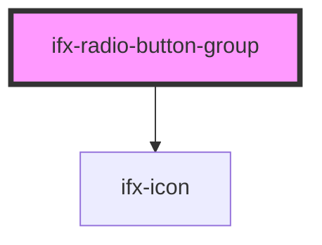

# ifx-radio-button-group

<!-- Auto Generated Below -->

## Properties

| Property          | Attribute           | Description                                                      | Type                         | Default              |
| ----------------- | ------------------- | ---------------------------------------------------------------- | ---------------------------- | -------------------- |
| `alignment`       | `alignment`         | Layout direction of the checkbox group (horizontal or vertical). | `"horizontal" \| "vertical"` | `"vertical"`         |
| `captionText`     | `caption-text`      | Text used for the caption below the group.                       | `string`                     | `undefined`          |
| `groupLabelText`  | `group-label-text`  | Text used as the group label.                                    | `string`                     | `"Group Label Text"` |
| `required`        | `required`          | Whether selecting at least one checkbox is required.             | `boolean`                    | `false`              |
| `showCaption`     | `show-caption`      | Whether to show a caption under the group.                       | `boolean`                    | `undefined`          |
| `showCaptionIcon` | `show-caption-icon` | Whether to show an icon next to the caption text.                | `boolean`                    | `undefined`          |
| `showGroupLabel`  | `show-group-label`  | Whether to show the group label above the checkboxes.            | `boolean`                    | `undefined`          |
| `size`            | `size`              | Size of the checkbox group (e.g. small, medium).                 | `string`                     | `undefined`          |

## Methods

### `setGroupError(error: boolean) => Promise<void>`

Method to set the error state of all radio-butttons in the group

#### Parameters

| Name    | Type      | Description |
| ------- | --------- | ----------- |
| `error` | `boolean` |             |

#### Returns

Type: `Promise<void>`

## Dependencies

### Depends on

- [ifx-icon](../icon)

### Graph

```mermaid
graph TD;
  ifx-radio-button-group --> ifx-icon
  style ifx-radio-button-group fill:#f9f,stroke:#333,stroke-width:4px
```

----------------------------------------------

*Built with [StencilJS](https://stenciljs.com/)*
