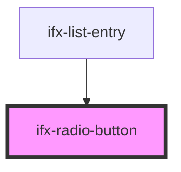

# ifx-radio-button

<!-- Auto Generated Below -->

## Properties

| Property   | Attribute  | Description | Type         | Default |
| ---------- | ---------- | ----------- | ------------ | ------- |
| `disabled` | `disabled` |             | `boolean`    | `false` |
| `error`    | `error`    |             | `boolean`    | `false` |
| `size`     | `size`     |             | `"m" \| "s"` | `"s"`   |
| `value`    | `value`    |             | `boolean`    | `false` |

## Events

| Event       | Description | Type               |
| ----------- | ----------- | ------------------ |
| `ifxChange` |             | `CustomEvent<any>` |

## Dependencies

### Used by

 - [ifx-list-entry](../list/list-entry)

### Graph

----------------------------------------------

*Built with [StencilJS](https://stenciljs.com/)*
