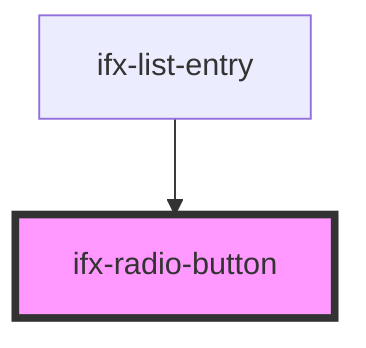

# ifx-radio-button

<!-- Auto Generated Below -->

## Properties

| Property   | Attribute  | Description                                                 | Type         | Default     |
| ---------- | ---------- | ----------------------------------------------------------- | ------------ | ----------- |
| `checked`  | `checked`  | Whether the checkbox is currently checked (can be updated). | `boolean`    | `undefined` |
| `disabled` | `disabled` | If true, the checkbox is disabled and not interactive.      | `boolean`    | `false`     |
| `error`    | `error`    | If true, the checkbox is shown in an error state.           | `boolean`    | `false`     |
| `name`     | `name`     | Name attribute used when submitting the checkbox in a form. | `string`     | `undefined` |
| `size`     | `size`     | Size of the checkbox (small or medium).                     | `"m" \| "s"` | `"s"`       |
| `value`    | `value`    | Value submitted when the checkbox is checked.               | `string`     | `undefined` |

## Events

| Event       | Description                                              | Type               |
| ----------- | -------------------------------------------------------- | ------------------ |
| `ifxChange` | Fired when the checked state of the checkbox changes.    | `CustomEvent<any>` |
| `ifxError`  | Fired when the checkbox enters or leaves an error state. | `CustomEvent<any>` |

## Methods

### `isChecked() => Promise<boolean>`

Returns the current checked state of the checkbox.

#### Returns

Type: `Promise<boolean>`

## Dependencies

### Used by

 - [ifx-list-entry](../table-advanced-version/list/list-entry)

### Graph

```mermaid
graph TD;
  ifx-list-entry --> ifx-radio-button
  style ifx-radio-button fill:#f9f,stroke:#333,stroke-width:4px
```

----------------------------------------------

*Built with [StencilJS](https://stenciljs.com/)*
