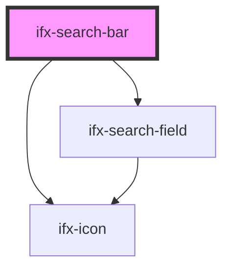

# ifx-search-bar

<!-- Auto Generated Below -->

## Properties

| Property   | Attribute  | Description | Type      | Default     |
| ---------- | ---------- | ----------- | --------- | ----------- |
| `disabled` | `disabled` |             | `boolean` | `false`     |
| `isOpen`   | `is-open`  |             | `boolean` | `true`      |
| `value`    | `value`    |             | `string`  | `undefined` |

## Events

| Event                | Description | Type               |
| -------------------- | ----------- | ------------------ |
| `ifxInput`           |             | `CustomEvent<any>` |
| `ifxSearchBarIsOpen` |             | `CustomEvent<any>` |

## Methods

### `onNavbarMobile() => Promise<void>`

#### Returns

Type: `Promise<void>`

## Dependencies

### Depends on

- [ifx-search-field](../search-field)
- [ifx-icon](../icon)

### Graph

----------------------------------------------

*Built with [StencilJS](https://stenciljs.com/)*
