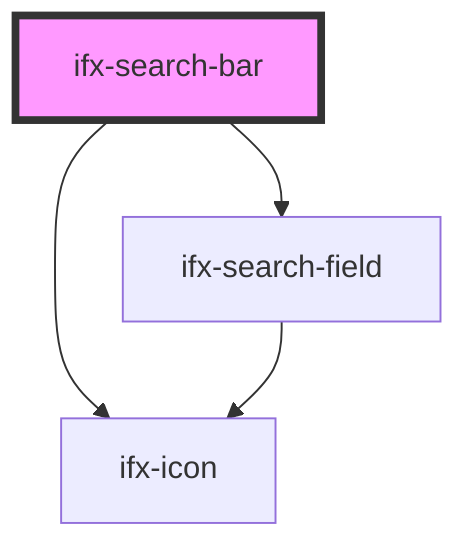

# ifx-search-bar

<!-- Auto Generated Below -->

## Properties

| Property       | Attribute      | Description                                                                                                                      | Type      | Default     |
| -------------- | -------------- | -------------------------------------------------------------------------------------------------------------------------------- | --------- | ----------- |
| `autocomplete` | `autocomplete` | Autocomplete behavior passed to the underlying search field.                                                                     | `string`  | `"on"`      |
| `disabled`     | `disabled`     | Disables user interaction with the search field and close control.                                                               | `boolean` | `false`     |
| `isOpen`       | `is-open`      | Controls whether the search bar is expanded (open) or collapsed. This is mirrored into internal state and drives the visible UI. | `boolean` | `true`      |
| `maxlength`    | `maxlength`    | Maximum allowed length for the search input.                                                                                     | `number`  | `undefined` |
| `value`        | `value`        | Current input value of the search field. This is updated when the field emits input events.                                      | `string`  | `undefined` |

## Events

| Event      | Description                                                                   | Type               |
| ---------- | ----------------------------------------------------------------------------- | ------------------ |
| `ifxInput` | Emits when the search input value changes.                                    | `CustomEvent<any>` |
| `ifxOpen`  | Emits when the search bar is opened or closed. Payload is the new open state. | `CustomEvent<any>` |

## Methods

### `onNavbarMobile() => Promise<void>`

Closes the search bar when triggered from a mobile navbar context.
Emits `ifxOpen` with `false` and updates internal state.

#### Returns

Type: `Promise<void>`

## Dependencies

### Depends on

- [ifx-search-field](../search-field)
- [ifx-icon](../icon)

### Graph

```mermaid
graph TD;
  ifx-search-bar --> ifx-search-field
  ifx-search-bar --> ifx-icon
  ifx-search-field --> ifx-icon
  style ifx-search-bar fill:#f9f,stroke:#333,stroke-width:4px
```

----------------------------------------------

*Built with [StencilJS](https://stenciljs.com/)*
