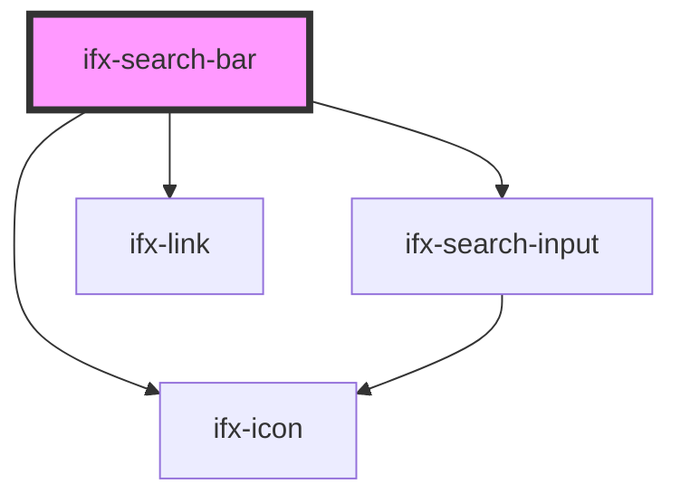

# ifx-search-bar

<!-- Auto Generated Below -->

## Properties

| Property          | Attribute           | Description | Type      | Default     |
| ----------------- | ------------------- | ----------- | --------- | ----------- |
| `hideLabel`       | `hide-label`        |             | `boolean` | `false`     |
| `icon`            | `icon`              |             | `string`  | `undefined` |
| `isOpen`          | `is-open`           |             | `boolean` | `true`      |
| `showCloseButton` | `show-close-button` |             | `boolean` | `true`      |
| `size`            | `size`              |             | `string`  | `""`        |
| `value`           | `value`             |             | `string`  | `''`        |

## Events

| Event      | Description | Type               |
| ---------- | ----------- | ------------------ |
| `ifxInput` |             | `CustomEvent<any>` |

## Dependencies

### Depends on

- [ifx-search-input](../search-input)
- [ifx-icon](../icon)
- [ifx-link](../link)

### Graph

----------------------------------------------

*Built with [StencilJS](https://stenciljs.com/)*
