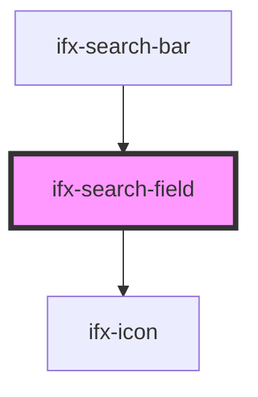

# ifx-search-input

<!-- Auto Generated Below -->

## Properties

| Property         | Attribute          | Description | Type      | Default       |
| ---------------- | ------------------ | ----------- | --------- | ------------- |
| `disabled`       | `disabled`         |             | `boolean` | `false`       |
| `placeholder`    | `placeholder`      |             | `string`  | `"Search..."` |
| `showDeleteIcon` | `show-delete-icon` |             | `boolean` | `false`       |
| `size`           | `size`             |             | `string`  | `'l'`         |
| `value`          | `value`            |             | `string`  | `''`          |

## Events

| Event      | Description | Type                  |
| ---------- | ----------- | --------------------- |
| `ifxInput` |             | `CustomEvent<String>` |

## Dependencies

### Used by

 - [ifx-search-bar](../search-bar)

### Depends on

- [ifx-icon](../icon)

### Graph

----------------------------------------------

*Built with [StencilJS](https://stenciljs.com/)*
