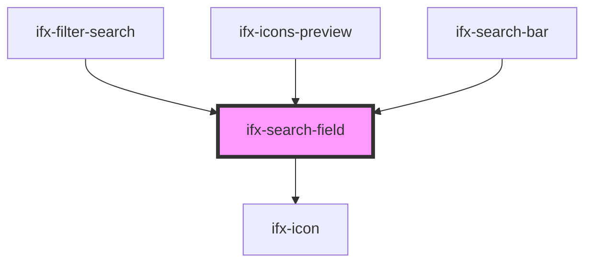

# ifx-search-input

<!-- Auto Generated Below -->

## Properties

| Property            | Attribute             | Description | Type               | Default                |
| ------------------- | --------------------- | ----------- | ------------------ | ---------------------- |
| `autocomplete`      | `autocomplete`        |             | `string`           | `"off"`                |
| `disabled`          | `disabled`            |             | `boolean`          | `false`                |
| `enableHistory`     | `enable-history`      |             | `boolean`          | `true`                 |
| `historyHeaderText` | `history-header-text` |             | `string`           | `'Recent Searches'`    |
| `historyKey`        | `history-key`         |             | `string`           | `'ifx-search-history'` |
| `maxSuggestions`    | `max-suggestions`     |             | `number`           | `10`                   |
| `maxlength`         | `maxlength`           |             | `number`           | `null`                 |
| `placeholder`       | `placeholder`         |             | `string`           | `"Search..."`          |
| `showDeleteIcon`    | `show-delete-icon`    |             | `boolean`          | `false`                |
| `showSuggestions`   | `show-suggestions`    |             | `boolean`          | `true`                 |
| `size`              | `size`                |             | `string`           | `'l'`                  |
| `suggestions`       | --                    |             | `SuggestionItem[]` | `[]`                   |
| `value`             | `value`               |             | `string`           | `''`                   |

## Events

| Event                    | Description | Type                          |
| ------------------------ | ----------- | ----------------------------- |
| `ifxBlur`                |             | `CustomEvent<void>`           |
| `ifxFocus`               |             | `CustomEvent<void>`           |
| `ifxInput`               |             | `CustomEvent<string>`         |
| `ifxSuggestionRequested` |             | `CustomEvent<string>`         |
| `ifxSuggestionSelected`  |             | `CustomEvent<SuggestionItem>` |

## Dependencies

### Used by

 - [ifx-filter-search](../table-advanced-version/filter-type-group/filter-search)
 - [ifx-icons-preview](../icons-preview)
 - [ifx-search-bar](../search-bar)

### Depends on

- [ifx-icon](../icon)

### Graph

----------------------------------------------

*Built with [StencilJS](https://stenciljs.com/)*
