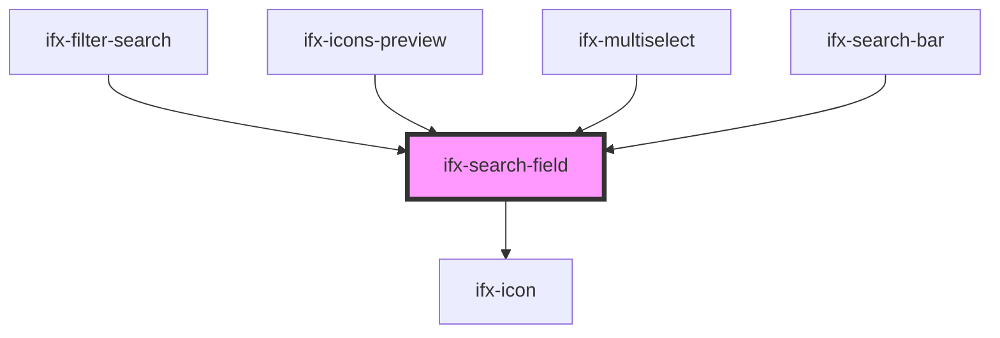

# ifx-search-input

<!-- Auto Generated Below -->

## Properties

| Property                 | Attribute                   | Description | Type               | Default                            |
| ------------------------ | --------------------------- | ----------- | ------------------ | ---------------------------------- |
| `ariaDescribedBy`        | `aria-described-by`         |             | `string`           | `undefined`                        |
| `ariaLabel`              | `aria-label`                |             | `string`           | `"Search Field"`                   |
| `ariaLabelledBy`         | `aria-labelled-by`          |             | `string`           | `undefined`                        |
| `autocomplete`           | `autocomplete`              |             | `string`           | `"off"`                            |
| `deleteIconAriaLabel`    | `delete-icon-aria-label`    |             | `string`           | `"Clear search"`                   |
| `disabled`               | `disabled`                  |             | `boolean`          | `false`                            |
| `dropdownAriaLabel`      | `dropdown-aria-label`       |             | `string`           | `"Search suggestions and history"` |
| `enableHistory`          | `enable-history`            |             | `boolean`          | `true`                             |
| `historyDeleteAriaLabel` | `history-delete-aria-label` |             | `string`           | `"Remove from history"`            |
| `historyHeaderText`      | `history-header-text`       |             | `string`           | `"Recent Searches"`                |
| `historyItemAriaLabel`   | `history-item-aria-label`   |             | `string`           | `"Search history item"`            |
| `historyKey`             | `history-key`               |             | `string`           | `"ifx-search-history"`             |
| `maxHistoryItems`        | `max-history-items`         |             | `number`           | `5`                                |
| `maxSuggestions`         | `max-suggestions`           |             | `number`           | `10`                               |
| `maxlength`              | `maxlength`                 |             | `number`           | `null`                             |
| `placeholder`            | `placeholder`               |             | `string`           | `"Search..."`                      |
| `showDeleteIcon`         | `show-delete-icon`          |             | `boolean`          | `false`                            |
| `showSuggestions`        | `show-suggestions`          |             | `boolean`          | `false`                            |
| `size`                   | `size`                      |             | `string`           | `"l"`                              |
| `suggestionAriaLabel`    | `suggestion-aria-label`     |             | `string`           | `"Search suggestion"`              |
| `suggestions`            | --                          |             | `SuggestionItem[]` | `[]`                               |
| `value`                  | `value`                     |             | `string`           | `""`                               |

## Events

| Event                    | Description | Type                          |
| ------------------------ | ----------- | ----------------------------- |
| `ifxBlur`                |             | `CustomEvent<void>`           |
| `ifxFocus`               |             | `CustomEvent<void>`           |
| `ifxInput`               |             | `CustomEvent<string>`         |
| `ifxSuggestionRequested` |             | `CustomEvent<string>`         |
| `ifxSuggestionSelected`  |             | `CustomEvent<SuggestionItem>` |

## Dependencies

### Used by

 - [ifx-filter-search](../table-advanced-version/filter-type-group/filter-search)
 - [ifx-icons-preview](../icons-preview)
 - [ifx-multiselect](../select/multi-select)
 - [ifx-search-bar](../search-bar)

### Depends on

- [ifx-icon](../icon)

### Graph

----------------------------------------------

*Built with [StencilJS](https://stenciljs.com/)*
