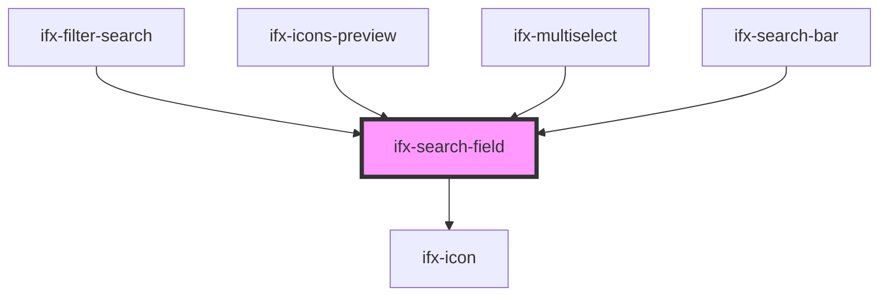

# ifx-search-input

<!-- Auto Generated Below -->

## Properties

| Property                 | Attribute                   | Description                                                                                                                                                                                                                        | Type               | Default                            |
| ------------------------ | --------------------------- | ---------------------------------------------------------------------------------------------------------------------------------------------------------------------------------------------------------------------------------- | ------------------ | ---------------------------------- |
| `ariaDescribedBy`        | `aria-described-by`         | ID of the element that describes the input.                                                                                                                                                                                        | `string`           | `undefined`                        |
| `ariaLabel`              | `aria-label`                | Accessible label for the input.                                                                                                                                                                                                    | `string`           | `"Search Field"`                   |
| `ariaLabelledBy`         | `aria-labelled-by`          | ID of the element that labels the input.                                                                                                                                                                                           | `string`           | `undefined`                        |
| `autocomplete`           | `autocomplete`              | Native autocomplete attribute value.                                                                                                                                                                                               | `string`           | `"off"`                            |
| `deleteIconAriaLabel`    | `delete-icon-aria-label`    | Accessible label for the clear icon button.                                                                                                                                                                                        | `string`           | `"Clear search"`                   |
| `disabled`               | `disabled`                  | Disable the input and related interactions.                                                                                                                                                                                        | `boolean`          | `false`                            |
| `dropdownAriaLabel`      | `dropdown-aria-label`       | Accessible label for the suggestions listbox.                                                                                                                                                                                      | `string`           | `"Search suggestions and history"` |
| `enableHistory`          | `enable-history`            | Enable local search history behavior and persistence.                                                                                                                                                                              | `boolean`          | `true`                             |
| `historyDeleteAriaLabel` | `history-delete-aria-label` | Accessible label for the history item delete button.                                                                                                                                                                               | `string`           | `"Remove from history"`            |
| `historyHeaderText`      | `history-header-text`       | Header text shown when only history entries are displayed.                                                                                                                                                                         | `string`           | `"Recent Searches"`                |
| `historyItemAriaLabel`   | `history-item-aria-label`   | Accessible label prefix for history items.                                                                                                                                                                                         | `string`           | `"Search history item"`            |
| `historyKey`             | `history-key`               | localStorage key used to persist search history. This is needed to allow multiple instances of the search field to maintain separate histories if desired, but can be left as default for a shared history across the application. | `string`           | `"ifx-search-history"`             |
| `maxHistoryItems`        | `max-history-items`         | Maximum number of stored history entries.                                                                                                                                                                                          | `number`           | `5`                                |
| `maxSuggestions`         | `max-suggestions`           | Maximum number of items shown in the dropdown (suggestions + history).                                                                                                                                                             | `number`           | `10`                               |
| `maxlength`              | `maxlength`                 | Maximum number of characters allowed in the input.                                                                                                                                                                                 | `number`           | `null`                             |
| `placeholder`            | `placeholder`               | Placeholder text for the input.                                                                                                                                                                                                    | `string`           | `"Search..."`                      |
| `showDeleteIcon`         | `show-delete-icon`          | Show the clear icon when there is a non-empty value.                                                                                                                                                                               | `boolean`          | `false`                            |
| `showSuggestions`        | `show-suggestions`          | Enable the suggestion dropdown and request events while typing.                                                                                                                                                                    | `boolean`          | `false`                            |
| `size`                   | `size`                      | Visual size variant. "s" enables compact styling, otherwise defaults to "l".                                                                                                                                                       | `"l" \| "s"`       | `"l"`                              |
| `suggestionAriaLabel`    | `suggestion-aria-label`     | Accessible label prefix for suggestion items.                                                                                                                                                                                      | `string`           | `"Search suggestion"`              |
| `suggestions`            | --                          | External suggestion items used to populate the dropdown.                                                                                                                                                                           | `SuggestionItem[]` | `[]`                               |
| `value`                  | `value`                     | Current input value. Mutates as the user types and can be set programmatically.                                                                                                                                                    | `string`           | `""`                               |

## Events

| Event                    | Description                                                  | Type                          |
| ------------------------ | ------------------------------------------------------------ | ----------------------------- |
| `ifxBlur`                | Emitted when the input loses focus.                          | `CustomEvent<void>`           |
| `ifxFocus`               | Emitted when the input gains focus.                          | `CustomEvent<void>`           |
| `ifxInput`               | Emitted on input change with the current value.              | `CustomEvent<string>`         |
| `ifxSuggestionRequested` | Emitted to request external suggestions for the given query. | `CustomEvent<string>`         |
| `ifxSuggestionSelected`  | Emitted when a suggestion or history item is selected.       | `CustomEvent<SuggestionItem>` |

## Methods

### `clearSearchHistory() => Promise<void>`

Public method to clear search history.
This will clear the history from both localStorage and the internal state, and also reset any dropdown-related states.

#### Returns

Type: `Promise<void>`

## Dependencies

### Used by

 - [ifx-filter-search](../table-advanced-version/filter-type-group/filter-search)
 - [ifx-icons-preview](../icons-preview)
 - [ifx-multiselect](../select/multi-select)
 - [ifx-search-bar](../search-bar)

### Depends on

- [ifx-icon](../icon)

### Graph

```mermaid
graph TD;
  ifx-search-field --> ifx-icon
  ifx-filter-search --> ifx-search-field
  ifx-icons-preview --> ifx-search-field
  ifx-multiselect --> ifx-search-field
  ifx-search-bar --> ifx-search-field
  style ifx-search-field fill:#f9f,stroke:#333,stroke-width:4px
```

----------------------------------------------

*Built with [StencilJS](https://stenciljs.com/)*
