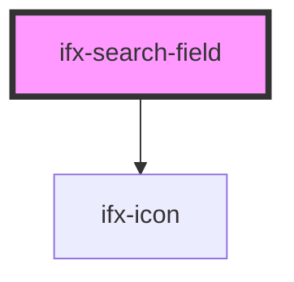

# ifx-search-input

<!-- Auto Generated Below -->

## Properties

| Property         | Attribute          | Description | Type      | Default     |
| ---------------- | ------------------ | ----------- | --------- | ----------- |
| `disabled`       | `disabled`         |             | `boolean` | `false`     |
| `showDeleteIcon` | `show-delete-icon` |             | `boolean` | `false`     |
| `size`           | `size`             |             | `string`  | `undefined` |
| `value`          | `value`            |             | `string`  | `''`        |

## Events

| Event      | Description | Type                            |
| ---------- | ----------- | ------------------------------- |
| `ifxInput` |             | `CustomEvent<CustomEvent<any>>` |

## Dependencies

### Depends on

- [ifx-icon](../icon)

### Graph

----------------------------------------------

*Built with [StencilJS](https://stenciljs.com/)*
