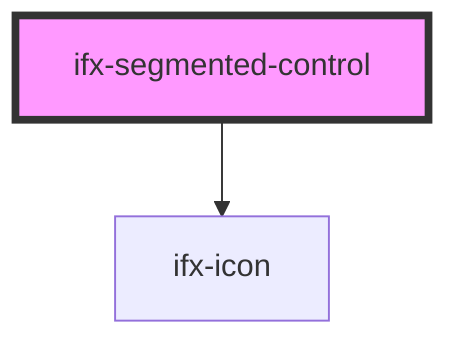

# ifx-segmented-controls-group

<!-- Auto Generated Below -->

## Properties

| Property   | Attribute  | Description                                             | Type                   | Default     |
| ---------- | ---------- | ------------------------------------------------------- | ---------------------- | ----------- |
| `caption`  | `caption`  | Helper text shown below the segmented control.          | `string`               | `""`        |
| `error`    | `error`    | If true, shows the segmented control in an error state. | `boolean`              | `false`     |
| `label`    | `label`    | Label text shown above the segmented control.           | `string`               | `""`        |
| `required` | `required` | Whether choosing a value is required.                   | `boolean`              | `false`     |
| `size`     | `size`     | Size of the segmented control (regular or small).       | `"regular" \| "small"` | `"regular"` |

## Events

| Event       | Description                                                       | Type                                                             |
| ----------- | ----------------------------------------------------------------- | ---------------------------------------------------------------- |
| `ifxChange` | Fired when the selected segment changes (previous and new value). | `CustomEvent<{ previousValue: string; selectedValue: string; }>` |

## Dependencies

### Depends on

- [ifx-icon](../icon)

### Graph

----------------------------------------------

*Built with [StencilJS](https://stenciljs.com/)*
