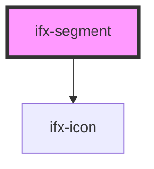

# ifx-segmented-control

<!-- Auto Generated Below -->

## Properties

| Property             | Attribute       | Description | Type      | Default     |
| -------------------- | --------------- | ----------- | --------- | ----------- |
| `icon`               | `icon`          |             | `string`  | `undefined` |
| `segmentIndex`       | `segment-index` |             | `number`  | `undefined` |
| `selected`           | `selected`      |             | `boolean` | `false`     |
| `value` _(required)_ | `value`         |             | `string`  | `undefined` |

## Events

| Event           | Description | Type                  |
| --------------- | ----------- | --------------------- |
| `segmentSelect` |             | `CustomEvent<number>` |

## Dependencies

### Depends on

- [ifx-icon](../../icon)

### Graph

----------------------------------------------

*Built with [StencilJS](https://stenciljs.com/)*
