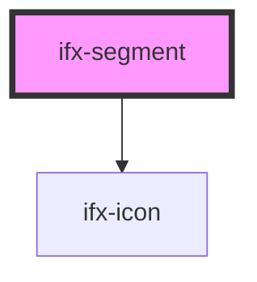

# ifx-segmented-control

<!-- Auto Generated Below -->

## Properties

| Property             | Attribute       | Description                                         | Type      | Default     |
| -------------------- | --------------- | --------------------------------------------------- | --------- | ----------- |
| `icon`               | `icon`          | Icon to display inside the segment.                 | `string`  | `undefined` |
| `segmentIndex`       | `segment-index` | Index of this segment within the segmented control. | `number`  | `undefined` |
| `selected`           | `selected`      | Whether this segment is currently selected.         | `boolean` | `false`     |
| `value` _(required)_ | `value`         | Value associated with this segment.                 | `string`  | `undefined` |

## Events

| Event           | Description                                                    | Type                  |
| --------------- | -------------------------------------------------------------- | --------------------- |
| `segmentSelect` | Fired when this segment is selected (emits the segment index). | `CustomEvent<number>` |

## Dependencies

### Depends on

- [ifx-icon](../../icon)

### Graph

```mermaid
graph TD;
  ifx-segment --> ifx-icon
  style ifx-segment fill:#f9f,stroke:#333,stroke-width:4px
```

----------------------------------------------

*Built with [StencilJS](https://stenciljs.com/)*
