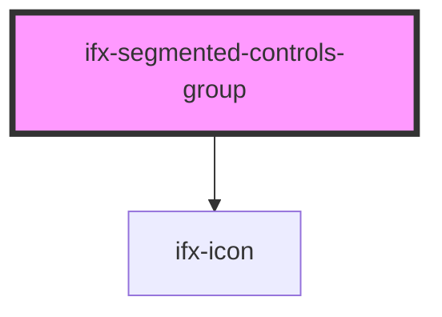

# ifx-segmented-controls-group

<!-- Auto Generated Below -->

## Properties

| Property     | Attribute     | Description                                     | Type                   | Default     |
| ------------ | ------------- | ----------------------------------------------- | ---------------------- | ----------- |
| `caption`    | `caption`     | Sets the caption which describe the controls.   | `string`               | `''`        |
| `groupLabel` | `group-label` | Sets the label for the segement controls group. | `string`               | `''`        |
| `size`       | `size`        | Sets the size of the segmented controls.        | `"regular" \| "small"` | `'regular'` |

## Dependencies

### Depends on

- [ifx-icon](../icon)

### Graph

----------------------------------------------

*Built with [StencilJS](https://stenciljs.com/)*
