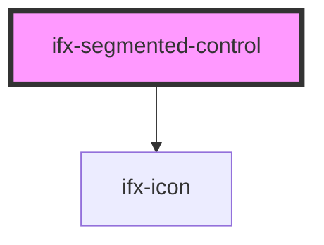

# ifx-segmented-control

<!-- Auto Generated Below -->

## Properties

| Property             | Attribute | Description | Type     | Default     |
| -------------------- | --------- | ----------- | -------- | ----------- |
| `icon`               | `icon`    |             | `string` | `undefined` |
| `value` _(required)_ | `value`   |             | `string` | `undefined` |

## Events

| Event           | Description | Type                  |
| --------------- | ----------- | --------------------- |
| `segmentSelect` |             | `CustomEvent<string>` |

## Dependencies

### Depends on

- [ifx-icon](../../icon)

### Graph

----------------------------------------------

*Built with [StencilJS](https://stenciljs.com/)*
