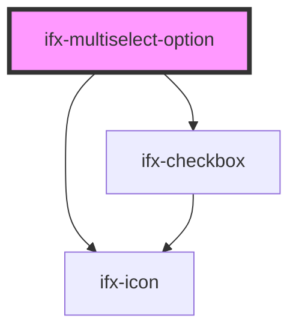

# ifx-multiselect

<!-- Auto Generated Below -->

## Properties

| Property        | Attribute       | Description | Type      | Default     |
| --------------- | --------------- | ----------- | --------- | ----------- |
| `disabled`      | `disabled`      |             | `boolean` | `false`     |
| `indeterminate` | `indeterminate` |             | `boolean` | `false`     |
| `selected`      | `selected`      |             | `boolean` | `false`     |
| `value`         | `value`         |             | `string`  | `undefined` |

## Dependencies

### Depends on

- [ifx-icon](../../icon)
- [ifx-checkbox](../../checkbox)

### Graph

----------------------------------------------

*Built with [StencilJS](https://stenciljs.com/)*
