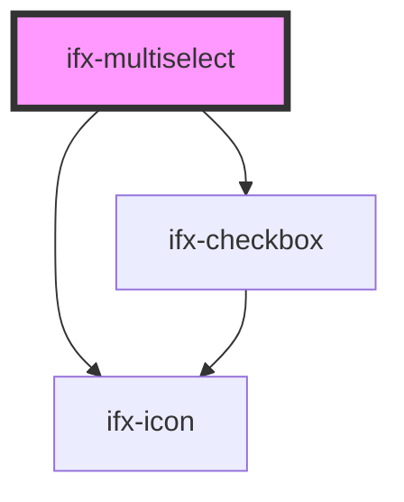

# ifx-multiselect

<!-- Auto Generated Below -->

## Properties

| Property        | Attribute        | Description | Type              | Default           |
| --------------- | ---------------- | ----------- | ----------------- | ----------------- |
| `batchSize`     | `batch-size`     |             | `number`          | `50`              |
| `disabled`      | `disabled`       |             | `boolean`         | `false`           |
| `error`         | `error`          |             | `boolean`         | `false`           |
| `errorMessage`  | `error-message`  |             | `string`          | `"Error"`         |
| `label`         | `label`          |             | `string`          | `""`              |
| `maxItemCount`  | `max-item-count` |             | `number`          | `undefined`       |
| `options`       | `options`        |             | `any[] \| string` | `undefined`       |
| `placeholder`   | `placeholder`    |             | `string`          | `""`              |
| `searchEnabled` | `search-enabled` |             | `boolean`         | `true`            |
| `size`          | `size`           |             | `string`          | `'medium (40px)'` |

## Events

| Event                  | Description | Type               |
| ---------------------- | ----------- | ------------------ |
| `ifxMultiselectIsOpen` |             | `CustomEvent<any>` |
| `ifxSelect`            |             | `CustomEvent<any>` |

## Dependencies

### Depends on

- [ifx-checkbox](../../checkbox)
- [ifx-icon](../../icon)

### Graph

----------------------------------------------

*Built with [StencilJS](https://stenciljs.com/)*
