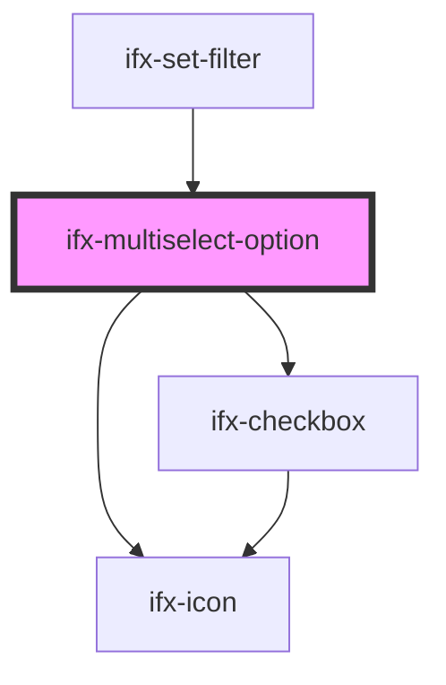

# ifx-multiselect

<!-- Auto Generated Below -->

## Properties

| Property        | Attribute       | Description                                                               | Type      | Default     |
| --------------- | --------------- | ------------------------------------------------------------------------- | --------- | ----------- |
| `disabled`      | `disabled`      | Whether this tree item is disabled and not interactive.                   | `boolean` | `false`     |
| `indeterminate` | `indeterminate` | Whether this tree item is in an indeterminate (partially selected) state. | `boolean` | `false`     |
| `selected`      | `selected`      | Whether this tree item is currently selected.                             | `boolean` | `false`     |
| `value`         | `value`         | Value associated with this tree item (used for selection and events).     | `string`  | `undefined` |

## Dependencies

### Used by

 - [ifx-set-filter](../../table-advanced-version/set-filter)

### Depends on

- [ifx-icon](../../icon)
- [ifx-checkbox](../../checkbox)

### Graph

```mermaid
graph TD;
  ifx-multiselect-option --> ifx-icon
  ifx-multiselect-option --> ifx-checkbox
  ifx-checkbox --> ifx-icon
  ifx-set-filter --> ifx-multiselect-option
  style ifx-multiselect-option fill:#f9f,stroke:#333,stroke-width:4px
```

----------------------------------------------

*Built with [StencilJS](https://stenciljs.com/)*
