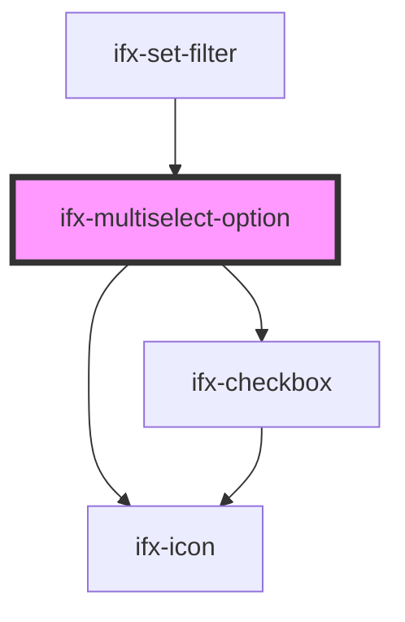

# ifx-multiselect

## Grouping options

Use `ifx-multiselect-group` to organize related options under a heading without adding another selectable item.

- An `ifx-multiselect-option` with children is a hierarchical, selectable parent. It displays a checkbox and expand/collapse control.
- An `ifx-multiselect-group` provides visual and semantic grouping only. It is not selectable or expandable.

```html
<ifx-multiselect label="KPIs">
  <ifx-multiselect-option value="all">All KPIs</ifx-multiselect-option>

  <ifx-multiselect-group label="Revenue">
    <ifx-multiselect-option value="revenue-total">
      Total revenue
    </ifx-multiselect-option>
    <ifx-multiselect-option value="revenue-region">
      Revenue by region
    </ifx-multiselect-option>
  </ifx-multiselect-group>
</ifx-multiselect>
```


<!-- Auto Generated Below -->


## Properties

| Property        | Attribute       | Description                                                               | Type      | Default     |
| --------------- | --------------- | ------------------------------------------------------------------------- | --------- | ----------- |
| `disabled`      | `disabled`      | Whether this tree item is disabled and not interactive.                   | `boolean` | `false`     |
| `indeterminate` | `indeterminate` | Whether this tree item is in an indeterminate (partially selected) state. | `boolean` | `false`     |
| `selected`      | `selected`      | Whether this tree item is currently selected.                             | `boolean` | `false`     |
| `value`         | `value`         | Value associated with this tree item (used for selection and events).     | `string`  | `undefined` |


## Slots

| Slot         | Description      |
| ------------ | ---------------- |
|              | The default slot |
| `"children"` |                  |


## Dependencies

### Used by

 - [ifx-set-filter](../../table-advanced-version/set-filter)

### Depends on

- [ifx-icon](../../icon)
- [ifx-checkbox](../../checkbox)

### Graph

```mermaid
graph TD;
  ifx-multiselect-option --> ifx-icon
  ifx-multiselect-option --> ifx-checkbox
  ifx-checkbox --> ifx-icon
  ifx-set-filter --> ifx-multiselect-option
  style ifx-multiselect-option fill:#f9f,stroke:#333,stroke-width:4px
```

----------------------------------------------

*Built with [StencilJS](https://stenciljs.com/)*
